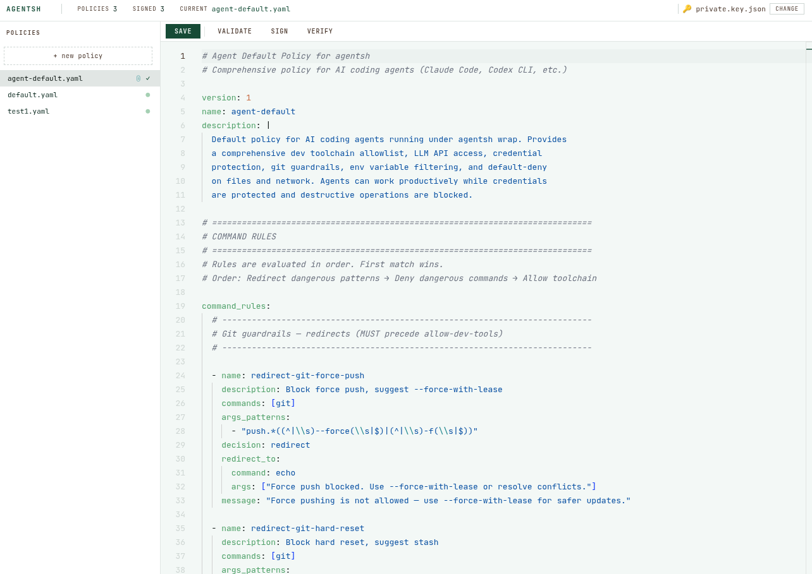

# agentsh Policy Editor

A browser-based editor for managing [agentsh](https://agentsh.org) policies. Edit YAML policies in a Monaco-powered editor, validate them against the agentsh schema, sign them with Ed25519 keys, and verify signatures — all from a local web UI.



## Quick Start

```bash
npx @agentsh/policy-editor
```

This starts a local server and opens your browser. The editor will look for policies in the default OS location and the `agentsh` binary on your PATH.

## Usage

```
agentsh-policy-editor [options]
```

### Options

| Flag | Default | Description |
|------|---------|-------------|
| `--agentsh <path>` | `agentsh` on PATH | Path to the agentsh binary |
| `--policies <dir>` | OS-dependent (see below) | Directory containing policy YAML files |
| `--private-key <path>` | *(none)* | Path to `private.key.json` for signing |
| `--trust-dir <dir>` | OS-dependent (see below) | Directory of public keys for verification |
| `--port <number>` | `0` (random available port) | Server port |
| `--no-open` | `false` | Don't auto-open the browser |

### Default Paths

| Platform | Policies | Trust Store |
|----------|----------|-------------|
| Linux | `~/.config/agentsh/policies` | `~/.config/agentsh/trust-store` |
| macOS | `~/Library/Application Support/agentsh/policies` | `~/Library/Application Support/agentsh/trust-store` |
| Windows | `%APPDATA%\agentsh\policies` | `%APPDATA%\agentsh\trust-store` |

### Examples

```bash
# Use defaults
agentsh-policy-editor

# Point to a specific policies directory and binary
agentsh-policy-editor --policies ./my-policies --agentsh /usr/local/bin/agentsh

# Pre-load a private key for signing
agentsh-policy-editor --private-key ~/keys/private.key.json

# Run on a specific port without opening the browser
agentsh-policy-editor --port 8080 --no-open
```

## Features

### Edit Policies
Browse and edit YAML policy files with full syntax highlighting powered by the Monaco editor (the same editor that powers VS Code). Create new policies from a blank template or by copying an existing one.

### Validate
Check that your policy is valid against the agentsh schema. Validation runs against the current editor content, so you can catch errors before saving. Saving also auto-validates and warns you if the policy is invalid.

### Sign
Sign policies with an Ed25519 private key. The editor will prompt you to select a key file using a built-in filesystem browser and enter a signer name. Both are remembered for the session. Signing creates a `.sig` file alongside the policy.

You need to generate a keypair before you can sign. Use the agentsh CLI:

```bash
# Generate an Ed25519 keypair
agentsh policy keygen --output ~/my-keys --label "my-name"
```

This creates two files in `~/my-keys/`:
- `private.key.json` — keep this secret (created with `0600` permissions)
- `public.key.json` — share this with anyone who needs to verify your signatures

When signing in the editor, point it to `private.key.json`. When verifying, the editor uses the directory containing the key files as the trust store.

### Verify
Verify policy signatures against the trust store (derived from the private key's directory). The sidebar shows signature status:

- **●** — signature file exists, not yet verified
- **✓** — signature verified
- **✗** — invalid signature detected
- **ⓘ** — click to view signature details (signer, date, key ID)

## Development

```bash
# Install dependencies
npm install

# Run in development mode
npm run dev -- --policies ./test-policies --agentsh /path/to/agentsh

# Run tests
npm test

# Build for distribution
npm run build

# Run the built version
npm start -- --policies ./test-policies
```

## How It Works

The editor is a TypeScript CLI that starts a local Express server bound to `127.0.0.1`. The server provides a REST API for policy CRUD operations and shells out to the `agentsh` binary for validation, signing, and verification. The frontend is a single HTML page with Monaco editor loaded from CDN — no build step required.

## License

Apache-2.0
